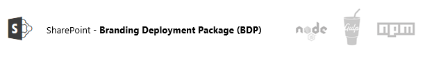

# Introduction #


* `Created by:` Bas Jacobs
* `Date:` 15-07-2017
* `Version: ` 1.0.0.2
* `Used at the following projects \ customer:` Macaw
* `Status` Reusable 

SharePoint Branding Deployment Package (BDP) for applying front-end design solutions on the SharePoint platform. This solution is build on [nodejs](https://nodejs.org) and [gulp](https://gulpjs.com/).



### Applies to ###
-  Office 365 Multi Tenant (MT)
-  Office 365 Dedicated (D)
-  SharePoint 2013 on-premises


# Prerequisites #
In order to run the script nodejs will need to be installed / configured. You can obtain nodejs from this [Link](https://nodejs.org)


# Usage #

```javascript
npm install
````

### Apply new module to devDependencies ###

```javascript
npm install [package] --save-dev
```

# Build tasks #

* `gulp build` Run all tasks together
* `gulp clean` Clean dist folder
* `gulp serve` Serve dist folder to SharePoint
* `gulp pagelayouts` Run task to build Page Layouts
* `gulp displaytemplates` Run task to build Display Templates
* `gulp scss` Run task to build scss
* `gulp images` Run task to distribute images
* `gulp scripts` Run task to distribute scripts
* `gulp fonts` Run task to distribute font
* `gulp components` Run task to distribute component items like .txt or .html snippets
* `gulp webserver` Run local server

_*Items will be distributed from the src to the dist folder._


# Folder structure #
* `dist` Generated distribution folder for serving files to SharePoint
* `src` Local source files stored in source control
* `gulp` Gulp task and configuration files
* `node modules` Generated folder containing node modules from package.json


# Feedback #
Place your feedback here


# Updates / Version History #
* V1.0.0.2 added sourcemaps
* V1.0.0.1 added webserver
* V1.0.0.1 initial version

Markdown style [cheatsheet](https://github.com/adam-p/markdown-here/wiki/Markdown-Cheatsheet)